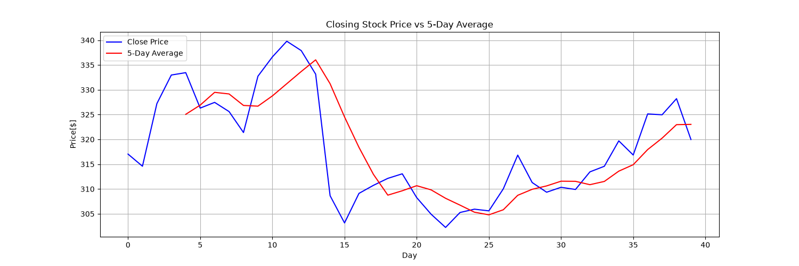

# Stock Moving Average Analysis

## Overview
This project analyzes financial stock time-series data to compute a 5-day Simple Moving Average (SMA). It demonstrates both manual loop logic and vectorized Pandas operations.

## Visual Output

## Implementations
1. **Algorithmic Logic:** Custom `for` loop iteration with `iloc` slicing to compute rolling windows manually.
2. **Pandas Vectorization:** `.rolling(window=20).mean()` for optimized time-series processing.
3. **Data Visualization:** `matplotlib` plot highlighting price trends against moving averages.

## Tech Stack
* Python 3
* Pandas
* Matplotlib
